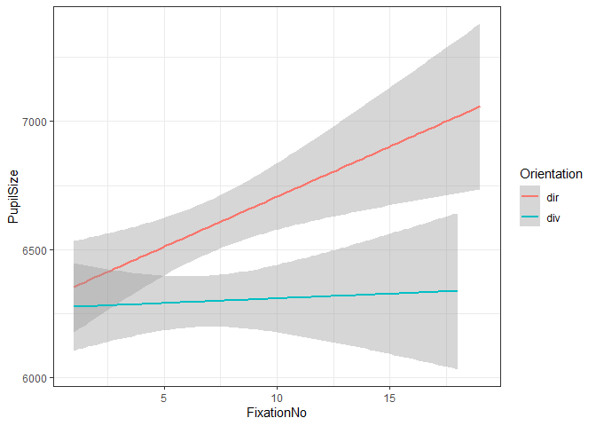
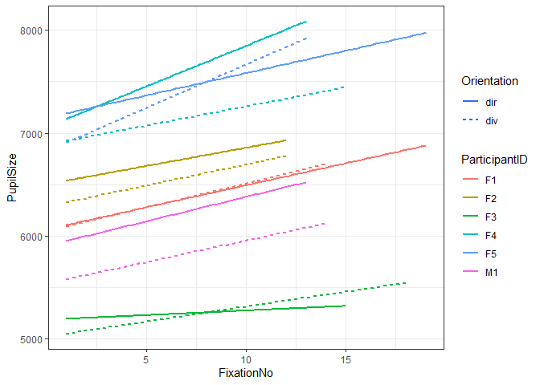
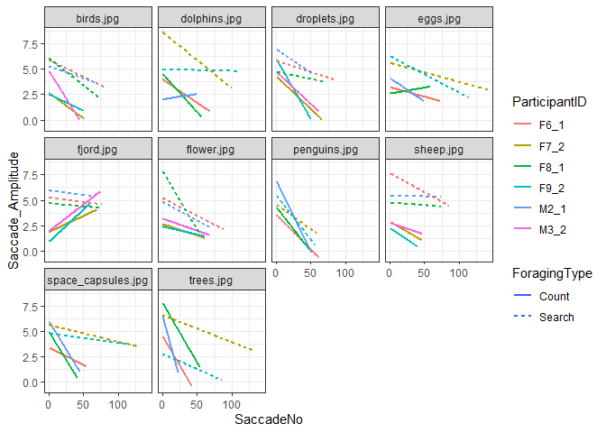
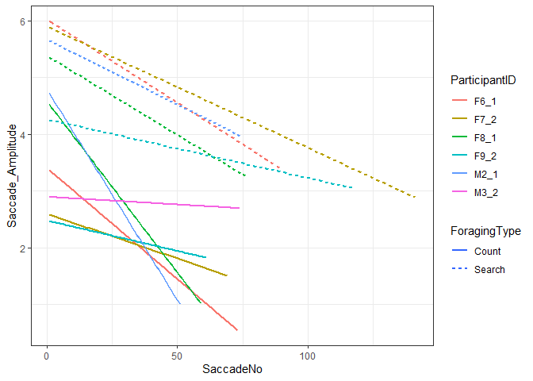

``` r
#Samples <- read_csv("Exported_EyeLink_data/Samples_merged.csv") %>% 
 # mutate(GazeY = 1051-GazeY, Fix_MeanY = 1051-Fix_MeanY) %>% 
  #filter(Time<=41202)

Samples <- read_csv("Exported_EyeLink_data/Samples_merged.csv", col_types = cols(ParticipantID = col_character(), ParticipantGender = col_character(), EyeTracked = col_character(), Task = col_character(), SearchOrder = col_double(), ForagingType = col_character(), Trial = col_double(), Stimulus = col_character(), Video = col_character(), Time = col_double(), GazeX = col_double(), GazeY = col_double(), PupilSize = col_double(), FixationNo = col_double(), Fix_StartTime = col_double(), Fix_EndTime = col_double(), Fix_Duration = col_double(), Fix_MeanX = col_double(), Fix_MeanY = col_double(), Fix_MeanPupilSize = col_double(), SaccadeNo = col_double(), Sac_StartTime = col_double(), Sac_EndTime = col_double(), Sac_Duration = col_double(), Sac_StartX = col_double(), Sac_StartY = col_double(), Sac_EndX = col_double(), Sac_EndY = col_double(), Sac_PeakVelocity = col_double(), Sac_MeanVelocity = col_double(), Sac_Blink = col_logical(), Sac_Direction = col_character(), Sac_Amplitude = col_double()))
```

What are the implications of modeling the data in a different way

Analysis for Assignment 1 Social Engagement
-------------------------------------------

``` r
#Social Engagement task
#We will look for differences in pupil size in engagement vs. observatonal only stimuli

## Subsetting the Social Engagement experiment
x = subset(Samples, Task == "SocialEngagement", !is.na(PupilSize))
#We take an average pupilsize for each fixation

#We make the video column into multiple columns
x <- separate(x, Video, c("Gender", NA, NA, "Orientation", "Ostensive"), remove = FALSE, sep = "_")

#We now group by participants and 
x <- x %>% group_by(Fix_MeanPupilSize, Trial, FixationNo, ParticipantID, Orientation, Ostensive, Gender) %>% 
  summarize(PupilSize = mean(PupilSize))

#We model
model <- glmer(PupilSize ~ 1 +  Orientation * Ostensive +
        (1 + Orientation * Ostensive | ParticipantID), data = x, family = gaussian(link=log))
```

    ## boundary (singular) fit: see ?isSingular

``` r
summary(model) #We use log because we believe it will reflect the data better. 
```

    ## Generalized linear mixed model fit by maximum likelihood (Laplace
    ##   Approximation) [glmerMod]
    ##  Family: gaussian  ( log )
    ## Formula: PupilSize ~ 1 + Orientation * Ostensive + (1 + Orientation *  
    ##     Ostensive | ParticipantID)
    ##    Data: x
    ## 
    ##      AIC      BIC   logLik deviance df.resid 
    ##   8748.0   8813.6  -4359.0   8718.0      572 
    ## 
    ## Scaled residuals: 
    ##     Min      1Q  Median      3Q     Max 
    ## -3.3555 -0.5137  0.1267  0.6528  2.4023 
    ## 
    ## Random effects:
    ##  Groups        Name                       Variance Std.Dev. Corr             
    ##  ParticipantID (Intercept)                  1662.7  40.776                   
    ##                Orientationdiv                189.1  13.750  -0.46            
    ##                Ostensive+o                    63.0   7.937  -0.38  0.38      
    ##                Orientationdiv:Ostensive+o    166.3  12.895   0.30 -0.97 -0.20
    ##  Residual                                 100691.9 317.320                   
    ## Number of obs: 587, groups:  ParticipantID, 6
    ## 
    ## Fixed effects:
    ##                             Estimate Std. Error t value Pr(>|z|)    
    ## (Intercept)                 8.789286   0.052495 167.430   <2e-16 ***
    ## Orientationdiv             -0.036199   0.017712  -2.044    0.041 *  
    ## Ostensive+o                -0.006153   0.010913  -0.564    0.573    
    ## Orientationdiv:Ostensive+o  0.012560   0.017854   0.704    0.482    
    ## ---
    ## Signif. codes:  0 '***' 0.001 '**' 0.01 '*' 0.05 '.' 0.1 ' ' 1
    ## 
    ## Correlation of Fixed Effects:
    ##             (Intr) Ornttn Ostns+
    ## Orientatndv -0.460              
    ## Ostensive+o -0.363  0.370       
    ## Ornttndv:O+  0.288 -0.917 -0.302
    ## convergence code: 0
    ## boundary (singular) fit: see ?isSingular

``` r
#Here we get no significant interaction so we model again without
model <- glmer(PupilSize ~ 0 +  Orientation + Ostensive +
        (0 + Orientation + Ostensive | ParticipantID), data = x, family = gaussian(link=log))
```

    ## boundary (singular) fit: see ?isSingular

``` r
summary(model)
```

    ## Generalized linear mixed model fit by maximum likelihood (Laplace
    ##   Approximation) [glmerMod]
    ##  Family: gaussian  ( log )
    ## Formula: PupilSize ~ 0 + Orientation + Ostensive + (0 + Orientation +  
    ##     Ostensive | ParticipantID)
    ##    Data: x
    ## 
    ##      AIC      BIC   logLik deviance df.resid 
    ##   8708.7   8752.5  -4344.4   8688.7      577 
    ## 
    ## Scaled residuals: 
    ##     Min      1Q  Median      3Q     Max 
    ## -3.3565 -0.6005  0.1130  0.6497  2.8827 
    ## 
    ## Random effects:
    ##  Groups        Name           Variance  Std.Dev. Corr       
    ##  ParticipantID Orientationdir   1700.37  41.236             
    ##                Orientationdiv   1457.75  38.181   1.00      
    ##                Ostensive+o        80.89   8.994  -0.15 -0.15
    ##  Residual                     111284.94 333.594             
    ## Number of obs: 587, groups:  ParticipantID, 6
    ## 
    ## Fixed effects:
    ##                  Estimate Std. Error t value Pr(>|z|)    
    ## Orientationdir  8.7858291  0.0504818 174.039   <2e-16 ***
    ## Orientationdiv  8.7559318  0.0467676 187.222   <2e-16 ***
    ## Ostensive+o    -0.0002751  0.0110071  -0.025     0.98    
    ## ---
    ## Signif. codes:  0 '***' 0.001 '**' 0.01 '*' 0.05 '.' 0.1 ' ' 1
    ## 
    ## Correlation of Fixed Effects:
    ##             Ornttndr Ornttndv
    ## Orientatndv  0.996           
    ## Ostensive+o -0.148   -0.149  
    ## convergence code: 0
    ## boundary (singular) fit: see ?isSingular

``` r
x$Ostensive <- as.factor(x$Ostensive)
x$Ostensive <- relevel(x$Ostensive, ref = "+o")

model <- glmer(PupilSize ~ 1 +  Orientation + Ostensive +
        (1 + Orientation + Ostensive | ParticipantID), data = x, family = gaussian(link=log))
```

    ## boundary (singular) fit: see ?isSingular

``` r
summary(model)
```

    ## Generalized linear mixed model fit by maximum likelihood (Laplace
    ##   Approximation) [glmerMod]
    ##  Family: gaussian  ( log )
    ## Formula: PupilSize ~ 1 + Orientation + Ostensive + (1 + Orientation +  
    ##     Ostensive | ParticipantID)
    ##    Data: x
    ## 
    ##      AIC      BIC   logLik deviance df.resid 
    ##   8714.6   8758.4  -4347.3   8694.6      577 
    ## 
    ## Scaled residuals: 
    ##     Min      1Q  Median      3Q     Max 
    ## -3.5736 -0.5922  0.0980  0.6413  2.7247 
    ## 
    ## Random effects:
    ##  Groups        Name           Variance  Std.Dev. Corr       
    ##  ParticipantID (Intercept)      4065.00  63.757             
    ##                Orientationdiv     15.24   3.904  -0.41      
    ##                Ostensive-o       814.28  28.536   0.81  0.20
    ##  Residual                     110274.99 332.077             
    ## Number of obs: 587, groups:  ParticipantID, 6
    ## 
    ## Fixed effects:
    ##                 Estimate Std. Error t value Pr(>|z|)    
    ## (Intercept)     8.831014   0.104753  84.303  < 2e-16 ***
    ## Orientationdiv -0.032936   0.006971  -4.725  2.3e-06 ***
    ## Ostensive-o     0.006929   0.044351   0.156    0.876    
    ## ---
    ## Signif. codes:  0 '***' 0.001 '**' 0.01 '*' 0.05 '.' 0.1 ' ' 1
    ## 
    ## Correlation of Fixed Effects:
    ##             (Intr) Ornttn
    ## Orientatndv -0.473       
    ## Ostensive-o  0.877 -0.126
    ## convergence code: 0
    ## boundary (singular) fit: see ?isSingular

``` r
#We get a significant effect of the diverted orientation. When doing it with link = identity we do not get anything significant. 

#We need to plot it
ggplot(x, aes(FixationNo, PupilSize, color = Orientation)) + geom_smooth(method = "lm")
```



``` r
#We plot with participant ID as well
ggplot(x, aes(FixationNo, PupilSize, color = ParticipantID, fill = Orientation)) + geom_smooth(method = "lm", se = F, aes(linetype=Orientation))
```



Analysis for Assignment 1 Foraging experiment
---------------------------------------------

``` r
## Subsetting the Forarging experiment
x = subset(Samples, Task == "Foraging", !is.na(SaccadeNo))

x <- x %>% group_by(ParticipantID, Stimulus, ForagingType, SaccadeNo) %>% summarise(Saccade_Amplitude = mean(Sac_Amplitude, na.rm = TRUE))

#We model
sac_ampl_gaus <- glmer(Saccade_Amplitude ~ 1 + ForagingType + 
        (1 + ForagingType | ParticipantID) +  
        (1 + ForagingType | Stimulus), data = x, family = gaussian(link=log))
```

    ## boundary (singular) fit: see ?isSingular

``` r
summary(sac_ampl_gaus)
```

    ## Generalized linear mixed model fit by maximum likelihood (Laplace
    ##   Approximation) [glmerMod]
    ##  Family: gaussian  ( log )
    ## Formula: 
    ## Saccade_Amplitude ~ 1 + ForagingType + (1 + ForagingType | ParticipantID) +  
    ##     (1 + ForagingType | Stimulus)
    ##    Data: x
    ## 
    ##      AIC      BIC   logLik deviance df.resid 
    ##  20434.4  20490.5 -10208.2  20416.4     3753 
    ## 
    ## Scaled residuals: 
    ##     Min      1Q  Median      3Q     Max 
    ## -1.5870 -0.6024 -0.3034  0.3149  6.2025 
    ## 
    ## Random effects:
    ##  Groups        Name               Variance Std.Dev. Corr
    ##  Stimulus      (Intercept)         0.0000  0.0000       
    ##                ForagingTypeSearch  0.3844  0.6200    NaN
    ##  ParticipantID (Intercept)         0.0000  0.0000       
    ##                ForagingTypeSearch  0.1257  0.3545    NaN
    ##  Residual                         13.0516  3.6127       
    ## Number of obs: 3762, groups:  Stimulus, 10; ParticipantID, 6
    ## 
    ## Fixed effects:
    ##                    Estimate Std. Error t value Pr(>|z|)    
    ## (Intercept)         0.92669    0.03553  26.082  < 2e-16 ***
    ## ForagingTypeSearch  0.53761    0.07907   6.799 1.05e-11 ***
    ## ---
    ## Signif. codes:  0 '***' 0.001 '**' 0.01 '*' 0.05 '.' 0.1 ' ' 1
    ## 
    ## Correlation of Fixed Effects:
    ##             (Intr)
    ## FrgngTypSrc -0.449
    ## convergence code: 0
    ## boundary (singular) fit: see ?isSingular

``` r
# We plot
ggplot(x, aes(SaccadeNo, Saccade_Amplitude, color=ParticipantID))+
  geom_smooth(aes(linetype=ForagingType), method="lm",se=F) + facet_wrap(.~Stimulus)
```



``` r
ggplot(x, aes(SaccadeNo, Saccade_Amplitude, color=ParticipantID))+
  geom_smooth(aes(linetype=ForagingType), method="lm",se=F)
```


